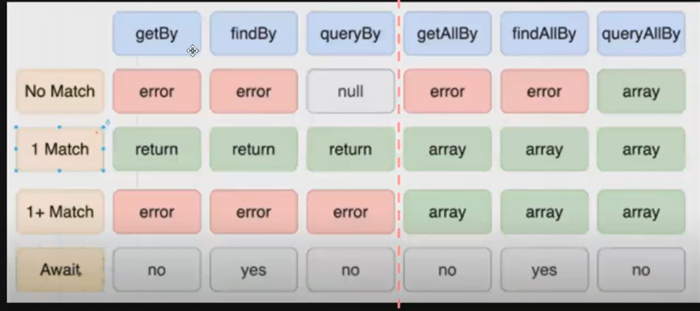

# Minggu 8 : 7 - 12 November 2022

---

# Module 15 - React Context

-   React Context digunakan untuk state management. Hampir mirip dengan redux, tapi tanpa install package (ada di react sendiri)
-   Langkah-langkah membuat React Context

    -   Buat file tersendiri untuk context
    -   Membuat context

        ```jsx
        import { createContext } from "react";

        const KerangjangCountContext = createContext();
        ```

    -   Memanggil contextnya
        ```jsx
        function KeranjangCountProvider() {
            return <KeranjangCountContext.Provider></KeranjangCountContext.Provider>;
        }
        ```
    -   Membuat state awal
        ```jsx
        import { useState } from "react";
        const [keranjangCount, setKeranjangCount] = useState(0);
        ```
    -   Tambahkan value pada provider
        ```jsx
        function KeranjangCountProvider() {
            return <KeranjangCountContext.Provider value={keranjangCount}></KeranjangCountContext.Provider>;
        }
        ```
    -   Menambahkan children
        ```jsx
        function KeranjangCountProvider({ children }) {
            return <KeranjangCountContext.Provider value={keranjangCount}>{...children}</KeranjangCountContext.Provider>;
        }
        ```
    -   Panggil di main.jsx
        ```jsx
        ReactDOM.createRoot(document.getElementById("root")).render(
            // <React.StrictMode>
            <KeranjangCountProvider>
                <App />
            </KeranjangCountProvider>
            // </React.StrictMode>
        );
        ```
    -   Menggunakan useContext untuk nilai yang berubah

        ```jsx
        import React, { useContext } from "react";
        import { KeranjangCountContext } from "../KeranjangCountProvider";

        function Keranjang() {
            const stateKeranjang = useContext(KeranjangCountContext);
            const totalKeranjang = stateKeranjang.keranjangCount;

            return (
                <div>
                    <span>Keranjang</span>
                    <span>{totalKeranjang}</span>
                </div>
            );
        }

        export default Keranjang;
        ```

        -   Tambahkan kode di counter

        ```jsx
        import React, { useContext, useState } from "react";
        import { KeranjangCountContext } from "../KeranjangCountProvider";

        function Counter() {
            const { keranjangCount, setKeranjangCount } = useContext(KeranjangCountContext);
            const [count, setCount] = useState(0);

            const increment = () => {
                setCount(count + 1);
                setKeranjangCount(keranjangCount + 1);
            };

            const decrement = () => {
                setCount(count - 1);
                setKeranjangCount(keranjangCount - 1);
            };

            return (
                <>
                    <button onClick={decrement}>-</button>
                    <span>{count}</span>
                    <button onClick={increment}>+</button>
                </>
            );
        }

        export default Counter;
        ```

-   Contoh context menggunakan useReducer

    `main.jsx`

    ```jsx
    import React from "react";
    import ReactDOM from "react-dom/client";
    import App from "./App";
    import Counter2Provider from "./context/Counter2Provider";
    import Counter1Provider from "./context/Counter1Provider";
    import TodoProvider from "./context/TodoProvider";

    ReactDOM.createRoot(document.getElementById("root")).render(
        // <React.StrictMode>
        <TodoProvider>
            <Counter2Provider>
                <Counter1Provider>
                    <App />
                </Counter1Provider>
            </Counter2Provider>
        </TodoProvider>
        // </React.StrictMode>
    );
    ```

    `App.jsx`

    ```jsx
    import Counter1 from "./components/Counter1";
    import Counter2 from "./components/Counter2";
    import TodoList from "./components/TodoList";

    function App() {
        return (
            <div className="App">
                <h3>Counter with context</h3>
                <Counter1 />

                <h3>Counter with context and useReducer</h3>
                <Counter2 />

                <TodoList />
            </div>
        );
    }

    export default App;
    ```

    `Counter1Provider.jsx`

    ```jsx
    import React, { createContext, useReducer, useState } from "react";

    export const CounterContext = createContext();

    function Counte1Provider({ children }) {
        const [count, setCount] = useState(0);

        return <CounterContext.Provider value={{ count, setCount }}>{children}</CounterContext.Provider>;
    }

    export default Counte1Provider;
    ```

    `Counter2Provider.jsx`

    ```jsx
    import React, { createContext, useReducer, useState } from "react";

    export const CounterContext = createContext();

    const INCREMENT = "INCREMENT";
    const DECREMENT = "DECREMENT";

    const initialState = {
        count: 0,
    };

    function reducer(state, action) {
        switch (action.type) {
            case INCREMENT:
                return { count: state.count + 1 };
            case DECREMENT:
                return { count: state.count - 1 };
            default:
                return state;
        }
    }

    function Counter2Provider({ children }) {
        const [state, dispatch] = useReducer(reducer, initialState);

        const increment = () => {
            dispatch({ type: INCREMENT });
        };

        const decrement = () => {
            dispatch({ type: DECREMENT });
        };

        return <CounterContext.Provider value={{ state, increment, decrement }}>{children}</CounterContext.Provider>;
    }

    export default Counter2Provider;
    ```

    `TodoProvider.jsx`

    ```jsx
    import React, { createContext, useReducer } from "react";

    export const TodoContext = createContext();

    const DELETE_TODO = "DELETE_TODO";

    const initialState = {
        todos: ["belajar reaact", "belajar context", "belajar redux"],
    };

    function reducer(state, action) {
        switch (action.type) {
            case DELETE_TODO:
                const newTodo = state.todos.filter((item, index) => index != action.index);
                return { todos: newTodo };
            default:
                return state;
        }
    }

    function TodoProvider({ children }) {
        const [state, dispatch] = useReducer(reducer, initialState);

        const deleteTodo = (index) => {
            console.log(index);
            dispatch({
                type: DELETE_TODO,
                index,
            });
        };

        return <TodoContext.Provider value={{ state, deleteTodo }}>{children}</TodoContext.Provider>;
    }

    export default TodoProvider;
    ```

    `Counter1.jsx`

    ```jsx
    import React, { useContext } from "react";
    import { CounterContext } from "../context/Counter1Provider";

    // komponen ini terhubung dengan Counter1Provider
    function Counter1() {
        const { count, setCount } = useContext(CounterContext);

        return (
            <div>
                <button onClick={() => setCount(count - 1)}>-</button>
                <span>{count}</span>
                <button onClick={() => setCount(count + 1)}>+</button>
            </div>
        );
    }

    export default Counter1;
    ```

    `Counter2.jsx`

    ```jsx
    import React, { useContext } from "react";
    import { CounterContext } from "../context/Counter2Provider";

    // komponen ini terhubung dengan Counter2Provider
    function Counter() {
        const { state, increment, decrement } = useContext(CounterContext);

        return (
            <div>
                <button onClick={decrement}>-</button>
                <span>{state.count}</span>
                <button onClick={increment}>+</button>
            </div>
        );
    }

    export default Counter;
    ```

    `TodoList.jsx`

    ```jsx
    import React, { useContext } from "react";
    import { TodoContext } from "../context/TodoProvider";

    function TodoList() {
        const { state, deleteTodo } = useContext(TodoContext);

        return (
            <div>
                <h1>Todo</h1>
                <form>
                    <input type="text" name="" id="" />
                    <button>add</button>
                </form>

                <ul>
                    {state.todos.map((item, index) => (
                        <li key={index}>
                            <span>{item}</span>
                            <button onClick={() => deleteTodo(index)}>x</button>
                        </li>
                    ))}
                </ul>
            </div>
        );
    }

    export default TodoList;
    ```

---

# Module 16 - React Testing

-   Tipe Testing ada 2 yaitu automation (kode) dan manual
-   Pembagian di Automation Testing ->

    -   **Unit Test** : melakukan pengujian di bagian yang paling kecil (function, kode")
    -   **Integration** : melakukan pengujian di bagian sistem satu sama lain, saling terhubung (kode dengan database)
    -   **End to end** : melakukan pengujian dari sisi user

    > semakin ke bawah semakin lambat dan biaya yang dikeluarkan banyak

-   2 cara menulis testing:
    -   membuat fitur lalu di testing
    -   membuat testing (+ ekspetasi) lalu buat fitur (TDD)
-   TDD circle of life:
    -   **Red Zone** = berupa ekspetasi
    -   **Green Zone** = membuat kode dan hasil sesuai ekspetasi
    -   **Refactor** = menambah perubahan

> Menulis testing membutuhkan waktu yang lama, spec yang jelas

**Membuat Testing:**

**Install Jest:**

> [Jest Website](https://jestjs.io/)

```
npm install -D jest
```

`app.js`

```javascript
// Soal | buat fungsi penjumlahan dengan 2 parameter

// function sum(x, y) {
//   return x + y
// }

const sum = (x, y) => x + y;

const checkGG = (n) => {
    if (n % 2 == 1) return "Ganjil";
    return "Genap";
};

const isOdd = (n) => {
    if (n % 2 == 1) return true;
};

module.exports = { sum, checkGG, isOdd };
```

`app.test.js`

```javascript
const { sum, checkGG, isOdd } = require("./app");

test("menjumlahkan angka pada sum()", () => {
    expect(sum(0, 0)).toBe(0);
    expect(sum(0, 1)).toBe(1);
    expect(sum(1, 1)).toBe(2);
    expect(sum(2, 2)).toBe(4);
});

test("check ganjil atau genap", () => {
    expect(checkGG(1)).toBe("Ganjil");
    expect(checkGG(2)).toBe("Genap");
    expect(checkGG(3)).toBe("Ganjil");
});

test("check ganjil", () => {
    expect(isOdd(1)).toBeTruthy();
    expect(isOdd(2)).toBeFalsy();
    expect(isOdd(3)).toBeTruthy();
});
```

## RTL

> [Website RTL](https://testing-library.com)

Menjalankan testing:

```
npm run test
```

Cara penulisan testing:

-   membuat test block dengan `test('', () => {})`
-   render component file menggunakan `render()`
-   lalu ambil bagian component menggunakan `screen`
-   ekspetasi ditulis dengan `expect()`

> Test Block:
>
> -   Render component
> -   Find element
> -   Interact with element (optional)
> -   Assert the result
>
> Banyak test block akan di simpan ke dalam describe block

Cara mengambil elemen:


Macam-macam query dan hasilnya:



Contoh testing:

`Counter.js`

```jsx
import React, { useState } from "react";

function Counter() {
    const [count, setCount] = useState(0);

    return (
        <div>
            <button onClick={() => setCount(count - 1)}>-</button>
            <span>{count}</span>
            <button onClick={() => setCount(count + 1)}>+</button>
        </div>
    );
}

export default Counter;
```

`Counter.test.js`

```javascript
import { fireEvent, render, screen } from "@testing-library/react";
import Counter from "./Counter";

test("render counter", () => {
    render(<Counter />);
    const decrementBtn = screen.getByText("-");
    const count = screen.getByText("0");
    const incrementBtn = screen.getByText("+");

    expect(decrementBtn).toBeInTheDocument();
    expect(count).toBeInTheDocument();
    expect(incrementBtn).toBeInTheDocument();
});

test("click increment button", () => {
    render(<Counter />);
    const incrementBtn = screen.getByText("+");
    const count = screen.getByText("0");

    expect(count.textContent).toBe("0");

    fireEvent.click(incrementBtn);
    expect(count.textContent).toBe("1");
});
```
